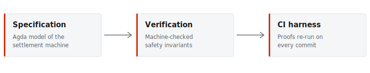

# Executive summary

This proposal outlines a three-month engagement to formally verify the
settlement layer of the client's payment network. The current implementation
has been audited twice by conventional means; both audits found issues that
static reasoning would have caught earlier and more cheaply.

We propose replacing spot-check auditing with a *machine-checked* specification
of the settlement invariants, so that every future change is validated against
the same proof obligations.

> The cost of a bug in a settlement layer is not the cost of the fix. It is the
> cost of every transaction that settled incorrectly before anyone noticed.

## Why now

The settlement layer is about to absorb two new asset classes. Each one widens
the state space that an auditor has to reason about by hand, and hand-reasoning
does not scale with that state space. Formalising the invariants **before** the
expansion is substantially cheaper than retrofitting proofs afterwards.

## What we deliver

- A mechanised specification of the settlement state machine
- Machine-checked proofs of the core safety and liveness invariants
- A regression harness that re-runs the proofs in CI on every commit
- A written report mapping each proof obligation back to a business rule

# Scope and approach

## Phase breakdown

The engagement splits into three phases. Each phase ends with a deliverable that
stands on its own, so the work can be stopped at a phase boundary without
stranding value.

| Phase | Duration | Deliverable | Effort |
| --- | --- | --- | --- |
| Specification | 4 weeks | Formal model of the settlement state machine | 1.5 FTE |
| Verification | 6 weeks | Machine-checked proofs of core invariants | 2.0 FTE |
| Integration | 2 weeks | CI harness, handover, and written report | 1.0 FTE |

## The invariants

Three properties carry most of the risk. Everything else in the specification
exists to support them.

1. **Conservation.** No sequence of operations creates or destroys value.
2. **Atomicity.** A settlement either completes fully or leaves no trace.
3. **Monotonicity.** Finalised settlements are never reordered or reverted.

### A worked example

Conservation is stated over the whole ledger rather than per-account, which is
what makes it robust to the multi-asset extension:

```haskell
-- The sum of all balances is invariant under any settlement step.
conservation :: Ledger -> Settlement -> Bool
conservation ledger step =
    totalValue ledger == totalValue (apply step ledger)
  where
    totalValue = foldr (\acct acc -> acc + balance acct) 0 . accounts
```

Note that `apply` is total: a settlement that would violate conservation is
rejected at the type level rather than at runtime, so the proof obligation
discharges without a case analysis on failure.

## Tooling

We work in Agda for the specification and extract an executable reference
implementation from it. The reference implementation is then used as a test
oracle against the production code, which means the proofs constrain the
shipping system rather than an idealised model of it.



# Commercial terms

## Pricing

The engagement is quoted at a fixed price of **€148,000**, invoiced against the
three phase completions. There is no time-and-materials component; scope changes
are handled by written amendment.

## Assumptions

- The client provides read access to the production settlement source
- One client engineer is available for roughly four hours per week
- The specification targets the settlement layer only, not the consensus layer

## Next steps

If the approach is agreeable, we will schedule a technical kickoff to align on
the exact invariant set before the specification phase begins. That session
typically takes half a day and involves two engineers from each side.
